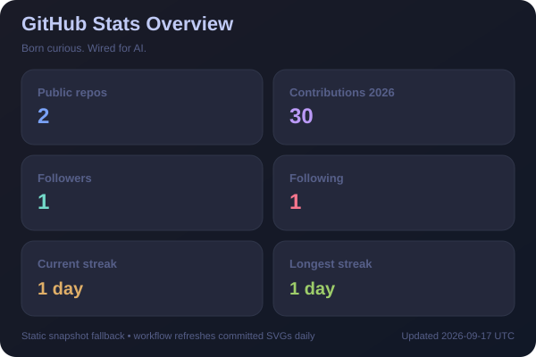
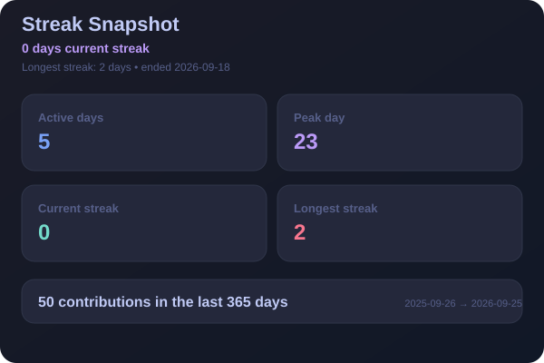
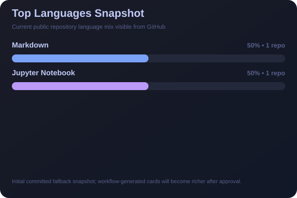
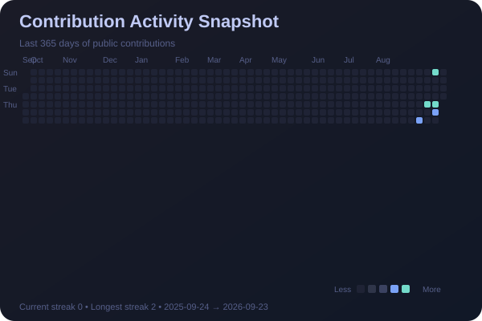
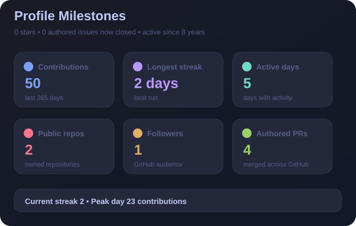
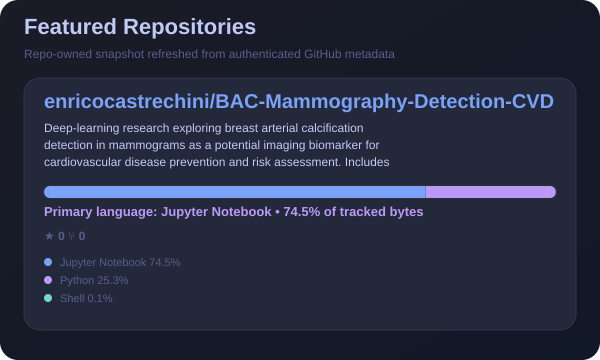

  

  
  

 

## 🧭 About Me

I work at the intersection of **Artificial Intelligence**, **engineering**, and **business strategy** — turning emerging technologies into practical solutions for complex industrial environments.

- 🤖 **Generative AI** — exploring GenAI, agentic systems, and AI-powered workflows for engineering
- 🚀 **Aerospace Engineering** — managing complex international proposals, aligning technical & strategic goals
- 💼 **Tech ↔ Business** — connecting AI/engineering decisions with business outcomes and customer needs
- 🔬 **Research** — dual MSc in Computer Engineering, with research in deep learning for medical imaging

 

## 🛠️ Tech Stack

  

 

## 📊 GitHub Analytics

  
  

  
  

🏆 GitHub Trophies

 

  

 

## 🌱 Currently Exploring

<table align="center">
<tr>
<td>🧠 Generative AI & agentic workflows</td>
<td>🏭 AI adoption in engineering organizations</td>
</tr>
<tr>
<td>🌐 Digital transformation & industrial innovation</td>
<td>👁️ Applied deep learning & computer vision</td>
</tr>
</table>

 

## 🚀 Featured Projects

  

<!-- Extend the PINNED_REPOS list in .github/scripts/generate_github_analytics.py
to include more public projects in this combined local card. -->

 

## 📫 Let's Connect

  

<i>Open to collaborations in AI, engineering innovation, and digital transformation.</i>

